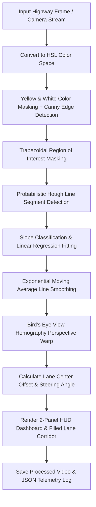

<div align="center">

# 🚗 Self-Driving Lane Line Detector & Steering Telemetry

### *Day 11 — 30-Day Computer Vision & Deep Learning Challenge*

[](https://www.python.org/)
[](https://opencv.org/)
[](https://numpy.org/)
[](LICENSE)
[](https://github.com/manasha1232)

*Autonomous driving lane line detection engine featuring HSL color filtering, Canny edge detection, Probabilistic Hough Transform, EMA curve smoothing, and Top-Down Bird's Eye View homography.*

---

</div>

## 📌 Overview

The **Self-Driving Lane Line Detector** is a fundamental autonomous vehicle vision module that isolates yellow shoulder lines and white center dividers, fits continuous lane boundaries, computes vehicle lane centering offset in real-time, and renders a 2-panel HUD displaying front camera view alongside a top-down **Bird's Eye View**.

### 🎯 Key Capabilities
- **HSL Color Space Filtering**: Dual-mask color isolation targeting solid yellow markings ($H: 15..35$) and bright white dividers ($L: 190..255$).
- **Trapezoidal ROI Masking**: Restricts computer vision operations to the forward-facing road perspective region.
- **Probabilistic Hough Transform (`cv2.HoughLinesP`)**: Identifies discrete line segments and groups candidate vectors by slope ($m_{left} \in [-1.2, -0.2]$, $m_{right} \in [0.2, 1.2]$).
- **Exponential Moving Average (EMA) Line Fitting**: Fits 1st-degree polynomials ($x = m y + b$) to extrapolate continuous lane boundaries with zero frame-to-frame flicker.
- **Top-Down Bird's Eye View (BEV)**: Computes a 4-point perspective warp matrix via `cv2.getPerspectiveTransform` to project road geometry into top-down view.
- **Vehicle Steering & Centering Telemetry**: Computes lane center vs. vehicle center offset ($\text{cm}$) and triggers dynamic steering alerts (`STEERING: CENTERED`, `DRIFTING LEFT`, `DRIFTING RIGHT`).

---

## 🏗️ System Architecture & Processing Pipeline



---

## 📁 Repository Structure

```text
self_driving_lane_line_detector/
├── lane_line_detector.py      # Core lane detector & steering telemetry engine
├── generate_demo_road_video.py# Synthetic highway driving video generator
├── requirements.txt           # Dependency declarations (opencv-python, numpy)
├── README.md                  # Project documentation
├── input/                     # Input highway video dataset
│   └── sample_road_driving.mp4
└── output/                    # Processed output video & telemetry JSON report
    ├── sample_road_driving_lane_detection_output.mp4
    └── sample_road_driving_lane_report.json
```

---

## ⚡ Quickstart & Installation

### 1. Install Dependencies
```bash
pip install -r requirements.txt
```

### 2. Generate Synthetic Highway Test Video
```bash
python generate_demo_road_video.py
```

### 3. Run Self-Driving Lane Line Detector
```bash
python lane_line_detector.py --input input/sample_road_driving.mp4 --output output
```

### 4. Live Webcam Mode
```bash
python lane_line_detector.py --input camera
```

---

## 📊 Telemetry Output Specification

```json
{
    "video_source": "sample_road_driving",
    "total_frames_processed": 150,
    "total_time_seconds": 3.0,
    "average_fps": 50.0,
    "mean_lane_offset_cm": -0.41,
    "output_video": "output/sample_road_driving_lane_detection_output.mp4"
}
```

---

## 👤 Author & Challenge Context

- **Challenge**: Day 11 of [30-Day Computer Vision & Deep Learning Challenge](https://github.com/manasha1232/30-Day-Computer-Vision-Challenge)
- **Author**: [@manasha1232](https://github.com/manasha1232)
- **License**: MIT License
